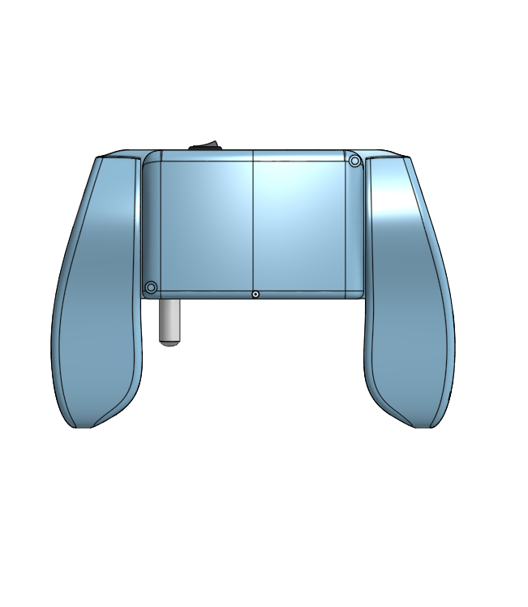
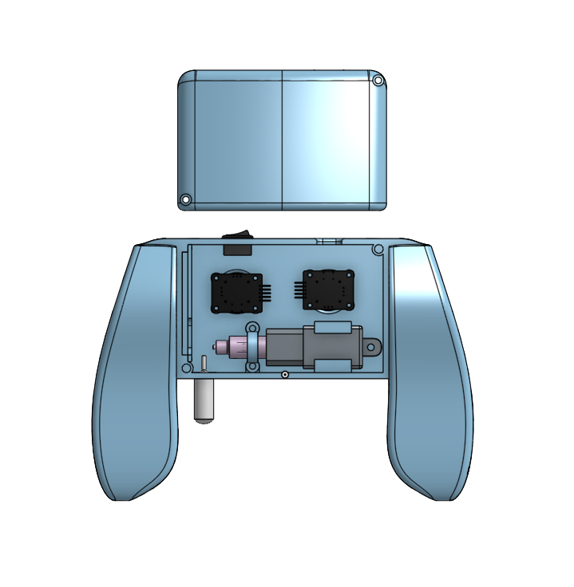
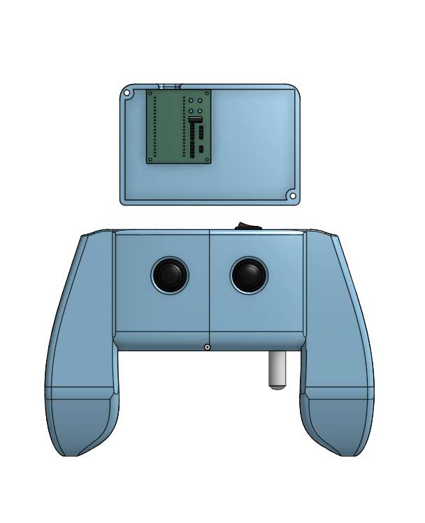

# haptic-joystick-system
A handheld controller that uses air pressure to send haptic feedback.

**Created by:** Ruzanna Gaboyan and Philip Golczak

**Date:** June 7, 2025

## Overview

The **Haptic Joystick System** is a *wireless controller that lets you wirelessly control robot arms in XYR directions* using your hand movement and pressure. It includes a two dual axis joystick modules for motion control in XYR directions, and a small squeezable air bulb that sends and receives air pressure signals. The controller *reads how hard you're squeezing using an air pressure sensor and can also send pressure back* into the bulb to communicate resistance.

**Why we made it**: By this project we wanted to make controlling robots more natural by *"feeling what they feel"* in addition to just moving them. This is useful especially in robotics tasks where pressure precision applied by the robot matters: like gripping and squeezing fragile objects. 

## Features
- **Pneumatic haptic feedback system:** Squeeze a small air bulb to send signals to a robot arm.
- **Joystick control**: Move the robot arm in XYR *(R-Rotation)* directions.
- **Two-way haptic feedback communication:** Air pumping piston mechanism also sends pressure back into the bulb when robot grips something.
- **Wireless communication:** ESP32 hamdles communication between the controller and the robot over Wi-Fi.
- **Custom PCB and 3D case:** Designed and built from scratch for this project.
- **OLED Display:** A little screen shows live data like grip pressure, feedback intensity and other info.
- **Ergonomic handle options:** In addition to the default casing, we CAD-ed an alternate ergonomic grip design for more comfort that can be added on the controller.

Ergonomic handle options: In addition to the default casing, we CAD-modeled an alternate ergonomic grip design for added comfort and modularity when holding the controller.

### Materials and Budget

| Part Number | Part Name                 | Description                                       | Unit Price | Total Price |
| :---------- | :-----------------------: | :-----------------------------------------------: | :--------: | ----------: |
| MP1         | ESP32                     | [Wi-Fi Microprocessor][1]                         | $10        | $10         |
| B1          | Urgenex Lipo Battery      | [Battery for the Controller][2]                   | $27        | $0 (owned)  |
| BC1         | Buck Converter 4mm (2x)   | [Buck Converter for 7.4–5v][3]                    | $8         | $0 (owned)  |
| J1, J2      | Joystick Module (2x)      | [KY-023 control joystick module][4]               | $7         | $7          |
| S1          | AITRIP Pressure Sensor    | [Barometric Pressure Sensor Module][5]            | $10        | $10         |
| PCB1        | PCB                       | [Fabricated PCB][6]                               | $5         | $5          |
| PINS        | Header Pins (20x)         | [Header Pins to mount joystick/sensor/ESP32][7]   | $9         | $9          |
| BT1         | Battery Connector         | [Plug in for LiPo battery][8]                     | $5         | $5          |
| BULB        | Pipet Bulb                | [4ml Air bulb for pressure sensor][9]             | $23        | $23         |
| TUBE        | Tubes                     | [Tube to connect the sensor, pump and air bulb][10]| $8        | $8          |
| CN1         | Tube T-Connectors         | [Connectors for the tube, air bulb, sensor and pump][11] | $6 | $6  |
| SYRINGE     | Syringe                   | [10ml Syringe for inflating and deflating][12]    | $2         | $2          |
| AT1         | Actuator                  | [Mini Linear Actuator to push air][13]            | $18        | $18         |
| MD1         | Motor Driver              | [Stepper Motor Driver Module][14]                 | $7         | $7          |
| SW1         | Boat Rocker Switch        | [Power Switch][15]                                | $5         | $5          |
| TOT         |                           |                                                   |            | **$128**    |

*Total excludes taxes and shipping.*

[1]: https://www.amazon.com/HiLetgo-ESP-WROOM-32-Development-Microcontroller-Integrated/dp/B0718T232Z/ref=sr_1_7?crid=3215NDM97THDZ&dib=eyJ2IjoiMSJ9.XBINg-sjhfF_gUtnMiKGjhlE-f5AuPRamTr33nRxSXkGLv_o48kwC8Ijeis6JInJV0KyHBRH7xGJQ-1txsZL4_5QVucvaXvokYACu1kJYTispfjw86LMs4pUaEb3QBf2tCHnMbfhxKmN1GqPyMwCe0JXg3RkQWr3XzxjTqvRC2Vi1yxUnR4MgBHJZC4l4B3sckUL9U6HKhcOjM0hclVNu3VH8A-i1EauSL7KfuJcGiQ.nLKf6GH-ppYlGRm2A-K7bqKU-ETPi6PvqRFLruHjBsE&dib_tag=se&keywords=esp+32&qid=1749497283&sprefix=esp+%2Caps%2C96&sr=8-7

[2]: https://www.amazon.com/URGENEX-Battery-1800mAh-Rechargeable-Campatibal/dp/B0924MM61Z/ref=sxin_17_sbv_search_btf?content-id=amzn1.sym.8aea4788-5372-43c5-bde7-3d239eb02a51%3Aamzn1.sym.8aea4788-5372-43c5-bde7-3d239eb02a51&crid=3Q08CKQ0G2YS0&cv_ct_cx=2s+lipo&keywords=2s+lipo&pd_rd_i=B0924MM61Z&pd_rd_r=2fee5f48-be65-4bef-8665-56cf135858b5&pd_rd_w=GqGDQ&pd_rd_wg=o6vhg&pf_rd_p=8aea4788-5372-43c5-bde7-3d239eb02a51&pf_rd_r=TBJT25WAE9YMH6TNV576&qid=1748989214&sbo=RZvfv%2F%2FHxDF%2BO5021pAnSA%3D%3D&sprefix=2s+lipo%2Caps%2C112&sr=1-1-5190daf0-67e3-427c-bea6-c72c1df98776

[3]: https://www.amazon.com/Maxmoral-Converter-Adjustable-Step-Down-Regulator/dp/B07MKQXNWG/ref=sr_1_8?crid=2O8Z0895WHHXP&dib=eyJ2IjoiMSJ9.Mn8RJg1NDqimTO87a_6HSzNLUgHkiPZ-VHvhyk_sEEX959uBLCpsnr1INDbSWpDKHzBUeE-YTWH4jJPt8yN_66qJGG0LMLLCtm2hUaRa0Z7giRo_BbYZ43KzK8a0ZkmFgm1_7exLw-T5nEHN_xsRLts72GEUkHbbKW-mQhQgRSSwipKjFBaNXV0R6c9MMWTGuIFDt9opV19PQrMrfOmi0de15Fu1fMhiF38ZXDObWWI.BWYEDRp61inwdzt085fWsmer4meqyVfUpvTSosCXECM&dib_tag=se&keywords=buck+converter+7.4v+to+5v&qid=1749758952&sprefix=buck+converter+7.4%2Caps%2C125&sr=8-8

[4]: https://www.amazon.com/Joystick-Sensor-Module-Controller-KY-023/dp/B08681KFSD/ref=sr_1_10?crid=1E848OO0UB6MF&dib=eyJ2IjoiMSJ9.u3HQgtLAVkNqZIGo3SvKEOzNBWX6ZNVLoT7k8LtlP1Q1wWEuSJHxLwehIw5ZghGOcfnQZu-ZMAmQ6Ww2_s23_kGGJeGnioDcVzOLxCIhUU6hEszKwp47MAoqIpnpcNRvna8PNP4FtM_az32gEZr8BEeL3efxdL4rTTUOm-LsfbszLXsTmBQpAnX1o6A8nbMVpDqjCLfOLJnQhYQgVFZUG3s8oemjdMGNsQQ6oyxN_wGaYH6LsFNlF6sb7Fy593foeJsBjy0jArnYQSpAIZb2ivtgjSpejtKT9yPfnVTiunE.aJeKjLLlRqorDPqIx0IPUUd55Zp8rLxmXE_ZoitJKM0&dib_tag=se&keywords=ky-023+joystick+module&qid=1751343982&sprefix=KY-023%2Caps%2C170&sr=8-10

[5]: https://www.amazon.com/AITRIP-Pressure-Digital-Barometric-Controller/dp/B09KXXBCYX/ref=sr_1_25?crid=2F4C227OBQ4GW&dib=eyJ2IjoiMSJ9.lnZjpD17ErzoexTM0Rp3kvS-a1fmm88Atb01fUkDGpjkwZqh4m0avbRKHBgpYfM2fKpw786wox12IeQUj7OqbzUDSfiXG6V9qWfqd8GLHUQk7-LhZ7_IMBlVILmKpyN6jWZbYrI0taD8gkPjfP83EuzwGLLpwwKfeiKyj-VsQZQ.ifDxpmw5px-izazzGScEMPMb2NFmPabu5s5iPriFklw&dib_tag=se&keywords=amazon+0-50+pka+electronic+pressure+sensor&qid=1751254193&sprefix=amazon+0-50+pka+electronic+pressure+sensor%2Caps%2C122&sr=8-25&xpid=2-4gjHsH4OvZN

[6]: https://jlcpcb.com/

[7]: https://www.amazon.com/Female-Header-ESP-WROOM-32-ESP32-DevKitC-Breakout/dp/B0CFDYMRK2

[8]: https://www.amazon.com/ZHOFONET-Connector-Adapter-Silicone-Battery/dp/B0DCFQPNFS/ref=sr_1_1_sspa?crid=3M1VK0ORPYIYJ&dib=eyJ2IjoiMSJ9.oGT8dUcPEt_-3myYRWftZ3DoP_hxXUXtj8rHjO44IODWJaF8r3qpxb3_LdaLFcHkSAlY6sRuTfXAtT4CJWVglcS8zBZgHf2INMpEWXcBu1VdJbOZB9d2uzsxLUbZVMqoylkjEW456rAB0vO9DUD9paL6Vtii-Hc4eGX3QDFHX630xEYBLuF5YEvH23S-KkzFMohth_k1CdhRRfUMT6oUCA_inkOBmX093ZZYt9TzGMmac0ODrnMp3IhxnIiXGf0n1mp5ki927JosQLKR-94rneH-L2sNrhOhUfYmVXyiR58.MXuIkj12e3vScXQKY50ODYn6wxcbGM-8giCcSQOPTRw&dib_tag=se&keywords=lipo%2Bbattery%2Bconnector&qid=1749872934&s=electronics&sprefix=lipo%2Bbattery%2Bconnector%2Celectronics%2C104&sr=1-1-spons&sp_csd=d2lkZ2V0TmFtZT1zcF9hdGY&th=1

[9]: https://www.amazon.com/Globe-Scientific-136020-500-Transfer-Non-Sterile/dp/B00G6T7TK8/ref=sr_1_3?crid=1OX1WNO21TU2&dib=eyJ2IjoiMSJ9.VQjYC05dg5DC_pLTeTpk3nRVc1AJv0WuQAZfGVHR5ojMFYO8M-iVik3UpPapAX5hykV2r9kTcsB7EkNS6kJRJOpIai_rMU2DnO64Am4TgIOOyh80mG9Z3LE_zue-9b7y_5-h2zf4coYVIlZADSNSU5N17oh_WH6aQjY5ia8K6gwBlKrPHWN_eEHKP2xptftpXFjFiIGYaHWRdD8hz6TXQ0vFMa55WIUcZpS8yvWYJw0.L5-XkWrQWf6pR1pEFPsV-H9sdBxVtRiUjUzStfuRq_A&dib_tag=se&keywords=4ml+pipette+bulb&qid=1751256021&sprefix=4ml+pipet+bulb%2Caps%2C111&sr=8-3

[10]: https://www.amazon.com/uxcell-Silicone-Tubing-Rubber-Transfer/dp/B085N17TDB?source=ps-sl-shoppingads-lpcontext&ref_=fplfs&psc=1&smid=A1THAZDOWP300U&

[11]: https://www.amazon.com/uxcell-30Pcs-Plastic-Joiner-Connector/dp/B06XFDTLG2?source=ps-sl-shoppingads-lpcontext&ref_=fplfs&psc=1&smid=A1THAZDOWP300U&

[12]: https://www.amazon.com/Syringe-Without-Liquids-Sterile-Packaged/dp/B0DDH5X9G3?source=ps-sl-shoppingads-lpcontext&ref_=fplfs&utm_source=chatgpt.com&th=1

[13]: https://www.amazon.com/Actuator-Electric-Actuators-Robotics-Automation/dp/B0D17H1HGV/ref=sr_1_11?crid=2D8IEOI5KRD1P&dib=eyJ2IjoiMSJ9.8iTWWDIeAPXoC8nvSBjcwo_nuJF1JKT8oE1vtMP-LigO1JEoP_wRZG6PvRmcitRd_iaRzQ7tpsqKZelP26UxduQ1g8p2EKhV9oTjZdDq2ZX6vN_AxtUk6nYKcYL7zN0FhTjKcqX9zKSgZVSIfiDsmbcydbhehNxJDNURVHEyQLBf_aId_7TXmyBYCyPemPdDeKB98i1k9Vz9woGk2q1G_xQ8GMGhqsLyltc57H5_tTo.EQ-cSv3l9KaSUrKxHWhRHtY38ZrUS8dUS6W-RMxPtg0&dib_tag=se&keywords=Micro%2BLinear%2BServo%2B%2F%2BLinear%2BActuator&qid=1751257050&sprefix=micro%2Blinear%2Bservo%2B%2F%2Blinear%2Bactuator%2Caps%2C199&sr=8-11&th=1

[14]: https://www.amazon.com/WWZMDiB-L298N-H-Bridge-Controller-Raspberry/dp/B0CR6BX5QL/ref=sr_1_3?crid=29082FZTVCC1N&dib=eyJ2IjoiMSJ9.utcrHO-ri72vm6OzWL_HHlqkZQVI1B-_qLhcMR2C5R5k3RBRZ1nYL2ckiLxC7Do4aCg7CWIuHJ3co5hLlnPR_qtDUzCv7QzPr-WLM6d-PYMzgThHLfaT1xYnQxcwDbsEvwtZC3u8SznGJYMsXMwIEyUFcm5EN3cyCeI2OefFIPcCTEPXSWe5sOm4TN8rblfwqd--MV30MaVRCKDfzR6hHnDbP_Hp5SplUI2RRNEFnHE.wVpY55BqILMdJGgtGYxkCZS6FOEDSo7ik3cOazcfbow&dib_tag=se&keywords=stepper%2Bmotor%2Bdriver%2Bmodule%2Bh%2Bbridge&qid=1751554092&sprefix=stepper%2Bmotor%2Bdriver%2Bmodule%2Bh%2Bbridge%2Caps%2C97&sr=8-3&th=1

[15]: https://www.amazon.com/10PCS-Rocker-Switch-Rectangle-Black/dp/B094FWYWL5/ref=pd_rhf_se_s_pd_sbs_rvi_d_sccl_2_3/140-6042190-5323536?pd_rd_w=4WVy0&content-id=amzn1.sym.6640a844-ab24-4352-ac9b-78899e683a5e&pf_rd_p=6640a844-ab24-4352-ac9b-78899e683a5e&pf_rd_r=DR52KG0H5RJ4PCX9CGEN&pd_rd_wg=gzPh0&pd_rd_r=7d525b38-a4b4-48b6-9cf1-d10f36e6cb2b&pd_rd_i=B094FWYWL5&th=1

## Notes on Purchasing and Shipping

We want to purchase most of the parts from Amazon. We chose Amazon as our primary supplier because we have access to Amazon Prime, which has faster and free shipping. The free shipping makes the packs cheaper than the singular alternatives at other sources. Some components, like the header pins, were only available in multi packs, so the unit price listed is price of the whole pack. Also, we own some of the parts, like the battery and boost converter, so their cost is put as $0.

## How it Works
1) Joystick modules send movement data wirelessly through ESP32 to the robot arm,
2) When you squeeze the air bulb the pressure sensor reads the force,
3) ESP32 sends that signal to the robot (like our [Remote Assist Hand](https://github.com/xsollwa/remote-assist-hand), but the controller can potentially be used on other robots as well),
4) If the robot grips something, it sends resistance signals back,
5) Air pumping mechanism activates and sends pressure into the bulb,
6) You feel it!
7) OLED screen displays pressure data, joystick values, connection status and more. Pressing either joystick down switched between display modes.

## Pictures 
**PCB**

  
   
  
   
  
   
  

**3D model**

  
   
  
   
  

## Building Process
1) Brainstorming and sketches
2) PCB design in KiCAD
3) CAD modeling in OnShape
4) Coding
5) Revision and Optimization
6) Assembly and testing

## Journal
Our full development journal can be found [here](./JOURNAL.md)

## Contact
For any questions or suggestions please reach out to us at *gaboyanruzanna@gmail.com* or *ph.golczak@gmail.com* .

